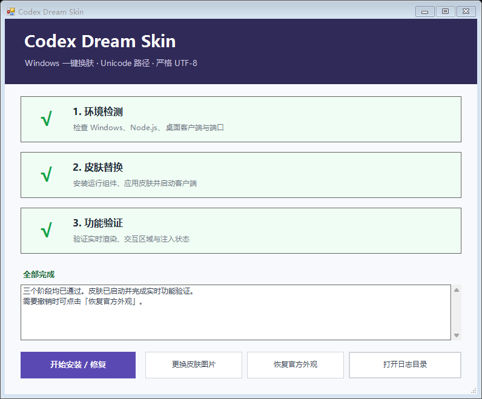

# Codex Dream Skin Universal

面向 Windows 版 Codex/ChatGPT 桌面客户端的可逆换肤工具。它通过本机回环 CDP 会话加载背景图与界面样式，保留原生侧边栏、项目列表、任务内容、输入框、菜单和键盘交互。

> 本项目不是 OpenAI 官方产品。`CodexDreamSkinLauncher.exe` 未签名，Windows SmartScreen 可能显示“未知发布者”。若不希望运行 EXE，可使用 `06_启动图形化控制台.bat` 打开相同的 GUI。



## 功能

- 一键完成环境检测、组件安装、皮肤应用和实时验证；
- 从 GUI 选择 PNG、JPG、JPEG 或 WebP 背景图；
- 自动适配横图、竖图、明暗主题和新版 Codex 首页结构；
- 支持重新应用、故障修复、日志查看和官方外观恢复；
- 动态识别 Microsoft Store 安装的 Codex/ChatGPT 客户端；
- 可为支持 `--remote-debugging-port` 的 Electron/Chromium 桌面客户端指定 EXE；
- 默认不改动 Codex 安装目录、程序签名、聊天记录、账号数据、API Key 或 `config.toml`。

## 运行要求

- Windows 10/11；
- Windows PowerShell 5.1 或更高版本；
- Node.js 22 或更高版本；
- Microsoft Store 版 Codex/ChatGPT 桌面应用，或兼容 CDP 的 Electron/Chromium 桌面客户端；
- 背景图片不超过 16 MB。

纯 API 请求、Python 脚本、Codex CLI、终端程序和 IDE 插件没有独立的桌面渲染页面，不能直接应用本皮肤。

## 快速开始

### 1. 打开图形界面

推荐双击：

```text
CodexDreamSkinLauncher.exe
```

若 EXE 被 SmartScreen 阻止，运行：

```text
06_启动图形化控制台.bat
```

两个入口打开的是同一套控制界面。

### 2. 首次安装或修复

点击 GUI 中的 **“开始安装 / 修复”**。程序会依次执行：

1. **环境检测**：检查 Windows、PowerShell、Node.js、目标客户端和可用端口；
2. **皮肤替换**：安装或更新运行组件，启动目标客户端并应用当前主题；
3. **功能验证**：检查皮肤版本、背景层、侧边栏、输入框、页面布局和交互状态。

客户端正在运行时会出现一次重启确认。保存尚未发送的输入后点击 **“是”**，等待 Codex 自动重新打开。三个阶段均显示绿色 `√` 即表示完成。

以下情况适合再次点击 **“开始安装 / 修复”**：

- 第一次使用；
- Codex 更新后皮肤失效；
- 启动或验证报错；
- 运行组件丢失、损坏或版本不一致；
- 需要完整重新应用当前主题。

## 更换皮肤图片

1. 打开 `CodexDreamSkinLauncher.exe`；
2. 点击 **“更换皮肤图片”**；
3. 选择 PNG、JPG、JPEG 或 WebP 图片；
4. 出现重启确认时点击 **“是”**；
5. 等待 Codex 自动重新打开；
6. 出现“背景图已更新并重新应用”即完成。

更换图片不需要重新点击 **“开始安装 / 修复”**。推荐使用清晰的横向图片；竖图同样支持，程序会根据宽高比自动选择显示方式。

## GUI 按钮说明

| 按钮 | 用途 |
| --- | --- |
| **开始安装 / 修复** | 执行环境检测、运行组件安装、皮肤应用和实时验证 |
| **更换皮肤图片** | 选择新背景图并重新应用当前皮肤 |
| **恢复官方外观** | 移除实时注入并关闭当前皮肤会话 |
| **打开日志目录** | 打开 `%LOCALAPPDATA%\CodexDreamSkin` |

## 恢复官方外观

点击 GUI 中的 **“恢复官方外观”**，确认后等待客户端自动重启。

恢复操作会移除实时 CSS/DOM 注入并关闭已保存的 CDP 会话。默认安装未修改 `config.toml`，因此不会覆盖其中与皮肤无关的配置。

## 日志与运行数据

运行数据保存在：

```text
%LOCALAPPDATA%\CodexDreamSkin
```

常用文件：

| 文件 | 内容 |
| --- | --- |
| `environment-report.txt` | 可读的环境检测报告 |
| `environment-report.json` | 结构化环境检测结果 |
| `target.json` | 当前目标客户端信息 |
| `state.json` | 已验证皮肤会话状态 |
| `verify.log` | 最近一次实时验证结果 |
| `injector.log` | 注入器运行记录 |
| `injector-error.log` | 注入器错误记录 |
| `active-theme\theme.json` | 当前主题配置 |
| `engine\` | 已安装的 Dream Skin 运行组件 |

GUI 阶段日志也会写入该目录。遇到错误时，可先点击 **“打开日志目录”** 查看最新的 `verify.log` 和 `gui-*.err.log`。

## 常见问题

### Dream Skin verification failed

表示背景或样式可能已经注入，但实时页面检查未全部通过。

1. 保持 Codex 停留在正常首页或任务页面；
2. 回到 GUI 点击 **“开始安装 / 修复”**；
3. 在重启确认框中点击 **“是”**；
4. 若仍失败，查看 `%LOCALAPPDATA%\CodexDreamSkin\verify.log`。

验证成功时，日志末尾应包含：

```json
"pass": true
```

### No supported ChatGPT/Codex desktop client was found

未找到受支持的桌面客户端。确认已安装 Microsoft Store 版 Codex/ChatGPT，或者运行 `00_环境扫描与配置.bat` 重新选择兼容的 Electron/Chromium 客户端 EXE。

### did not expose a verified loopback CDP endpoint

目标客户端未接受 `--remote-debugging-port`，或调试端口被安全策略阻止。原生 WinUI/WPF 应用通常不支持 Chromium 注入。

### Port 9335 is already occupied

默认模式会自动从附近端口中选择空闲端口。若手动命令显式指定了 `9335`，请删除显式端口参数后重试。

### `[WARN] API 环境`

表示未检测到 API 环境变量。使用 GPT 账号直接登录桌面客户端时属于正常提示，不影响安装和换肤。

### 操作正在进行或等待超时

启动、换图、验证和恢复使用同一个跨进程操作锁。前一项操作仍在收尾时，下一项最多等待 45 秒。超时日志会显示占用操作、PID 和开始时间。

## BAT/CMD 备用入口

日常使用推荐 GUI。以下入口用于排查或无 GUI 场景：

| 文件 | 用途 |
| --- | --- |
| `00_环境扫描与配置.bat` | 扫描环境并保存目标客户端 |
| `01_首次安装主题.cmd` | 安装运行组件并首次启动 |
| `02_启动或重新应用.cmd` | 启动或重新应用当前主题 |
| `03_更换皮肤图片.cmd` | 通过文件选择器更换背景图 |
| `04_验证当前皮肤.cmd` | 验证当前实时皮肤 |
| `05_恢复官方外观.cmd` | 移除皮肤并恢复官方外观 |
| `06_启动图形化控制台.bat` | 打开 PowerShell GUI |
| `07_重新生成EXE.bat` | 使用本机 MinGW GCC 重新生成 GUI 启动器 |

## PowerShell 进阶命令

以下命令应在项目根目录执行。

### 环境检测

```powershell
powershell.exe -NoProfile -STA -ExecutionPolicy Bypass `
  -File .\windows\scripts\scan-and-configure.ps1 -Configure
```

### 指定兼容客户端

```powershell
powershell.exe -NoProfile -STA -ExecutionPolicy Bypass `
  -File .\windows\scripts\scan-and-configure.ps1 `
  -Configure -AppExecutable "D:\Apps\CompatibleClient.exe"
```

目标会保存到：

```text
%LOCALAPPDATA%\CodexDreamSkin\target.json
```

### 启动或重新应用

```powershell
powershell.exe -NoProfile -ExecutionPolicy Bypass `
  -File .\windows\scripts\start-dream-skin.ps1 -PromptRestart
```

### 验证并保存截图

```powershell
powershell.exe -NoProfile -ExecutionPolicy Bypass `
  -File .\windows\scripts\verify-dream-skin.ps1 `
  -ScreenshotPath "C:\Temp\dream-skin-proof.png"
```

### 恢复官方外观

```powershell
powershell.exe -NoProfile -ExecutionPolicy Bypass `
  -File .\windows\scripts\restore-dream-skin.ps1 -PromptRestart
```

## `CODEX_HOME` 与配置文件

环境检测优先识别：

```text
%CODEX_HOME%\config.toml
```

未设置 `CODEX_HOME` 时使用：

```text
%USERPROFILE%\.codex\config.toml
```

默认安装只进行实时换肤，不读取、备份或重写上述配置文件。只有手动使用 `-ConfigureBaseTheme` 时，安装脚本才会备份并调整 `[desktop]` 外观项。

## 安全与可逆性

- CDP 仅监听本机回环地址；
- 启动器会核对端口、浏览器会话和目标进程身份；
- 装饰层使用 `pointer-events: none`，不会覆盖原生控件点击；
- 环境报告不会保存 API Key 内容；
- 自定义目标拒绝 UNC 网络路径和符号链接；
- 不修改 Microsoft Store 应用包、`app.asar` 或程序签名；
- 不修改账号、聊天、项目和模型提供商配置；
- 关闭皮肤会话或执行恢复后，可返回官方外观。

## 目录结构

```text
.
├─ CodexDreamSkinLauncher.exe
├─ CodexDreamSkinLauncher.ps1
├─ README-中文版.md
├─ 00_环境扫描与配置.bat
├─ 01_首次安装主题.cmd
├─ 02_启动或重新应用.cmd
├─ 03_更换皮肤图片.cmd
├─ 04_验证当前皮肤.cmd
├─ 05_恢复官方外观.cmd
├─ 06_启动图形化控制台.bat
├─ 07_重新生成EXE.bat
└─ windows
   ├─ assets
   └─ scripts
```

